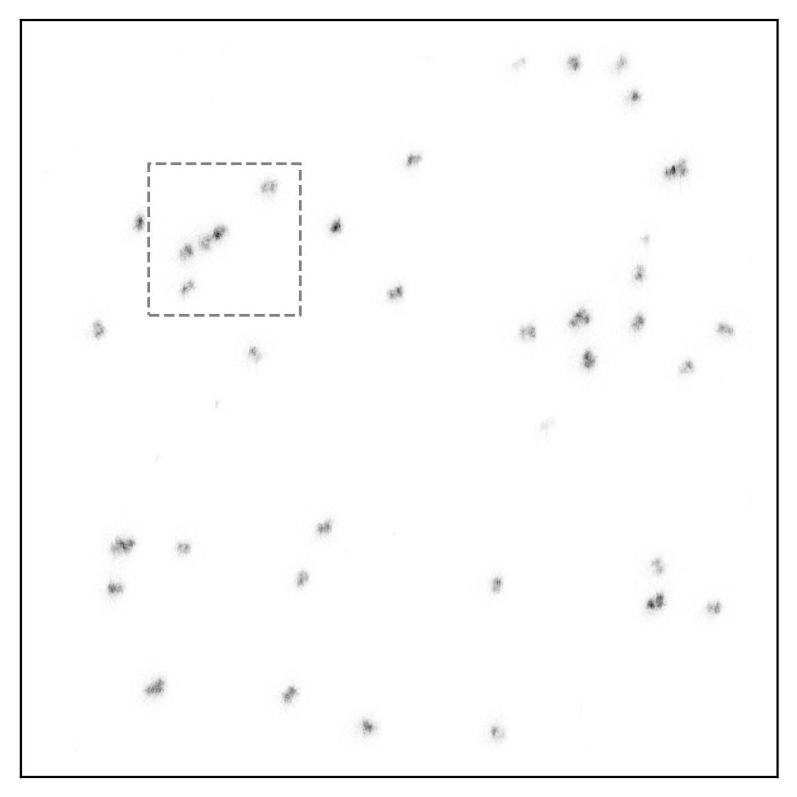

# [Local Poisson Deconvolution for Discrete Signals](https://arxiv.org/abs/2508.00824)

**Authors**: Shayan Hundrieser, Tudor Manole, Danila Litskevich, Axel Munk

<p align='center'> </p>

 We analyze the statistical problem of recovering an atomic signal, modeled as
a discrete uniform distribution $\mu$, from a binned Poisson convolution model.
This question is motivated, among others, by super-resolution laser microscopy
applications, where precise estimation of $\mu$ provides insights into spatial
formations of cellular protein assemblies. Our main results quantify the local
minimax risk of estimating $\mu$ for a broad class of smooth convolution
kernels. This local perspective enables us to sharply quantify optimal
estimation rates as a function of the clustering structure of the underlying
signal. Moreover, our results are expressed under a multiscale loss function,
which reveals that different parts of the underlying signal can be recovered at
different rates depending on their local geometry. Overall, these results paint
an optimistic perspective on the Poisson deconvolution problem, showing that
accurate recovery is achievable under a much broader class of signals than
suggested by existing global minimax analyses. Beyond Poisson deconvolution,
our results also allow us to establish the local minimax rate of parameter
estimation in Gaussian mixture models with uniform weights.

  We apply our methods to experimental super-resolution microscopy data to
identify the location and configuration of individual DNA origamis. In
addition, we complement our findings with numerical experiments on runtime and
statistical recovery that showcase the practical performance of our estimators
and their trade-offs.

This repository contains the implementation of the methods and evaluation scripts to reproduce the results.

## Installation

To set up the corresponding `conda` environment, run:

```sh
conda create -n poisson-deconvolution python=3.12.3
source activate poisson-deconvolution
```

Install dependencies via:

```sh
pip install -r requirements.txt
```

To install the library, run:

```sh
pip install -e .
```

## Usage

This section provides an overview of how to perform estimations and run simulations.

### Estimations

To perform estimations for your own data, follow these steps:

1. **Prepare your data**: Follow the [`datasets/readme`](datasets/readme.md) for detailed instructions on setting up your datasets.

2. **Configure parameters**: Along with the data, provide the necessary parameters for the estimations. Refer to the [`datasets/readme`](datasets/readme.md) for the details.

3. **Run estimations**: Use the [`scripts/estimate.py`](scripts/estimate.py) script to perform estimations on your dataset. Replace `dataset_name` with the name of your dataset.

```sh
python -m scripts.estimate dataset_name
```

4. **Plot results**: After running the estimations, visualize the results using the [`scripts/plot.py`](scripts/plot.py) script. Replace `dataset_name` with the name of your dataset. Refer to the [`results/readme`](results/readme.md) for plotting configurations.

```sh
python -m scripts.plot dataset_name
```

The estimations with plots will be saved in the `results/{dataset_name}` folder. Refer to the [`results/readme`](results/readme.md) for more details.


### Simulations

To run simulations for evaluating the performance of the estimators, follow these steps:

1. **Configure simulation settings**: Define the simulation settings in the configuration file. Refer to the [`simulations/readme`](simulations/readme.md) for detailed instructions on setting up your simulations.

2. **Run simulations**: Execute the simulations using the [`scripts/simulate.py`](scripts/simulate.py) script. Replace `simulation_name` and `setting_id` with your specific simulation parameters. Refer to the [`simulations/readme`](simulations/readme.md) for more details.

```sh
python -m scripts.simulate simulation_name setting_id
```

3. **Plot simulation results**: After running the simulations, visualize the results using the [`scripts/plot_simulations.py`](scripts/plot_simulations.py) script. Replace `simulation_name` with the name of your simulation.

```sh
python -m scripts.plot_simulations simulation_name
```

The simulation results and plots will be saved in the `simulations/{simulation_name}` folder. Refer to the [`simulations/readme`](simulations/readme.md) for more details.

## Datasets

The experimental STED microscopy data is considered from [here](https://doi.org/10.1214/17-AOS1669).

<p align="center">
  
   
</p>

## Citation

If you found our work useful, please consider citing us:

```bibtex
@article{hundrieser2025local,
  title   = {Local Poisson Deconvolution for Discrete Signals},
  author  = {{Shayan Hundrieser, Tudor Manole, Danila Litskevich, and Axel Munk}},
  year    = {2025},
  journal = {arXiv preprint}
}
```

## Contact

If you have questions, please contact us via GitHub Issues.
