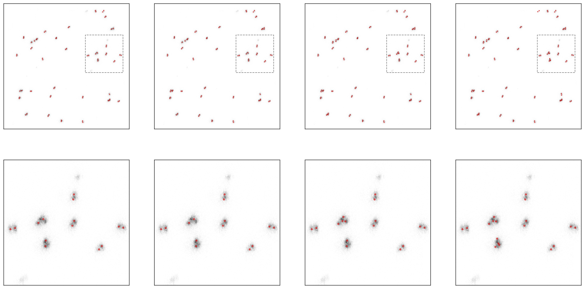
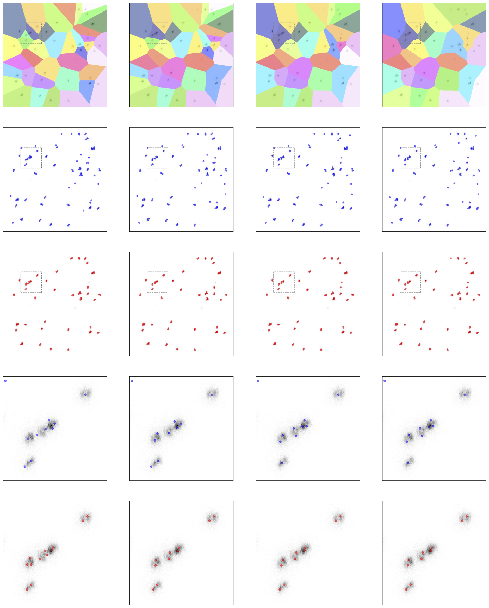
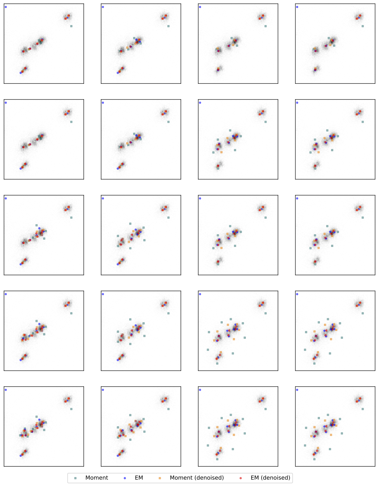

## Results overview

For the corresponding `dataset_name` a folder is created with the same name. The folder contains the following files:

- `data.npy` original data,
- `kernel.npy` convolution kernel,
- `config.json` configuration file used for the estimation,
- `plot-config.json` configuration file used for plotting,
- `estimations_d{delta}.json` aggregated estimations,
- `estimations/estim_{denoised}_d{delta}_n{num_atoms}_sc{scale}_{estimator}.json` only explicit locations of the estimations,
- `img/` and `img-zoom/` folders with plots.

## Plotting configurations

During the estimation procedure, the `plot-config.json` file is created in the folder. The file is used for plotting the results and has the following structure:

```json
{
  "x_lim": [0.17, 0.37],
  "y_lim": [0.61, 0.81],
  "best_delta": 0.045,
  "estimators": ["EM (moment)", "Moment", "EM (mode)", "Mode"],
  "deltas": [0.03, 0.045, 0.06, 0.075],
  "num_atoms": [40, 50, 60, 70, 80],
  "split_estim_config": {
    "num_atoms": 70,
    "estimator": "EM (moment)"
  },
  "zoom_estim_config": {
    "num_atoms": [40, 50, 60, 70, 80],
    "estimators": ["Moment", "EM (moment)"]
  }
}
```

Only specified parameters are used for plotting.

### Parameter descriptions

- `x_lim` and `y_lim`: Define the limits of the zoom-in region on the plots.

<p align="center">
  
   
</p>

- `estimators`: The estimators used to perform the estimations.
- `deltas`: The values used for joining Voronoi cells, i.e. the cells are joined if the distance between the seeds is less than `delta`.
- `num_atoms`: The number of mixture components (i.e. the number of molecules).

- `best_delta`: A `delta` value, which will be used for generating individual plots for each estimator from `estimators` (from left to right: `num_atoms`).
<p align="center">
  
</p>

- `split_estim_config`: Configuration for plotting estimations of the `estimator` across different `deltas` (from left to right) with the fixed `num_atoms`. Red dots are the estimations for denoised data, blue dots are the estimations for the original data.

<p align="center">
  
</p>

- `zoom_estim_config`: Configuration for plotting estimations in the zoom-in region across different `deltas` (from left to right), `num_atoms` (from top to bottom) and `estimators`.

<p align="center">
  
</p>
