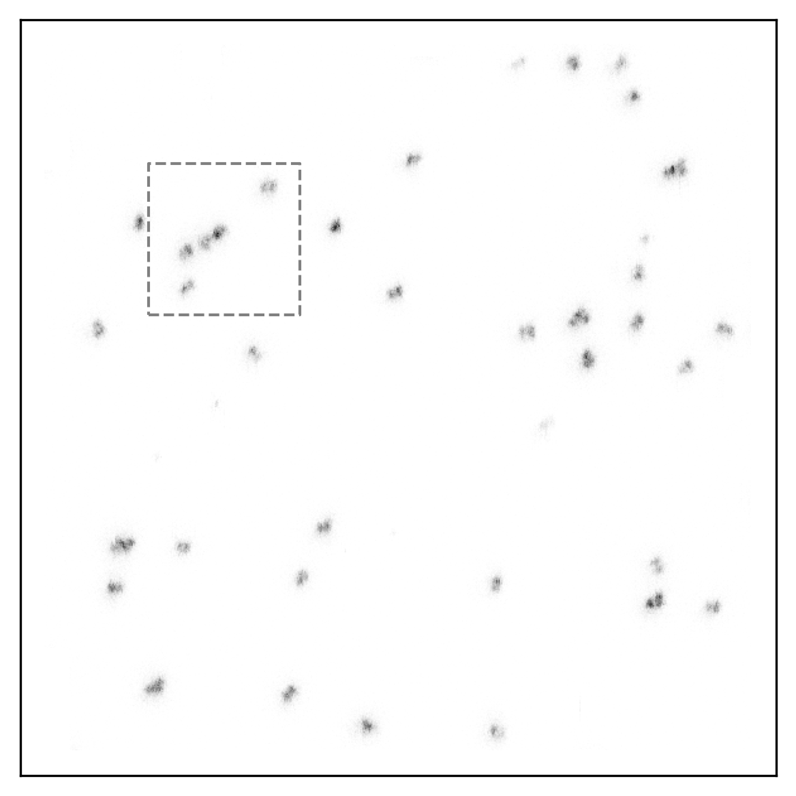
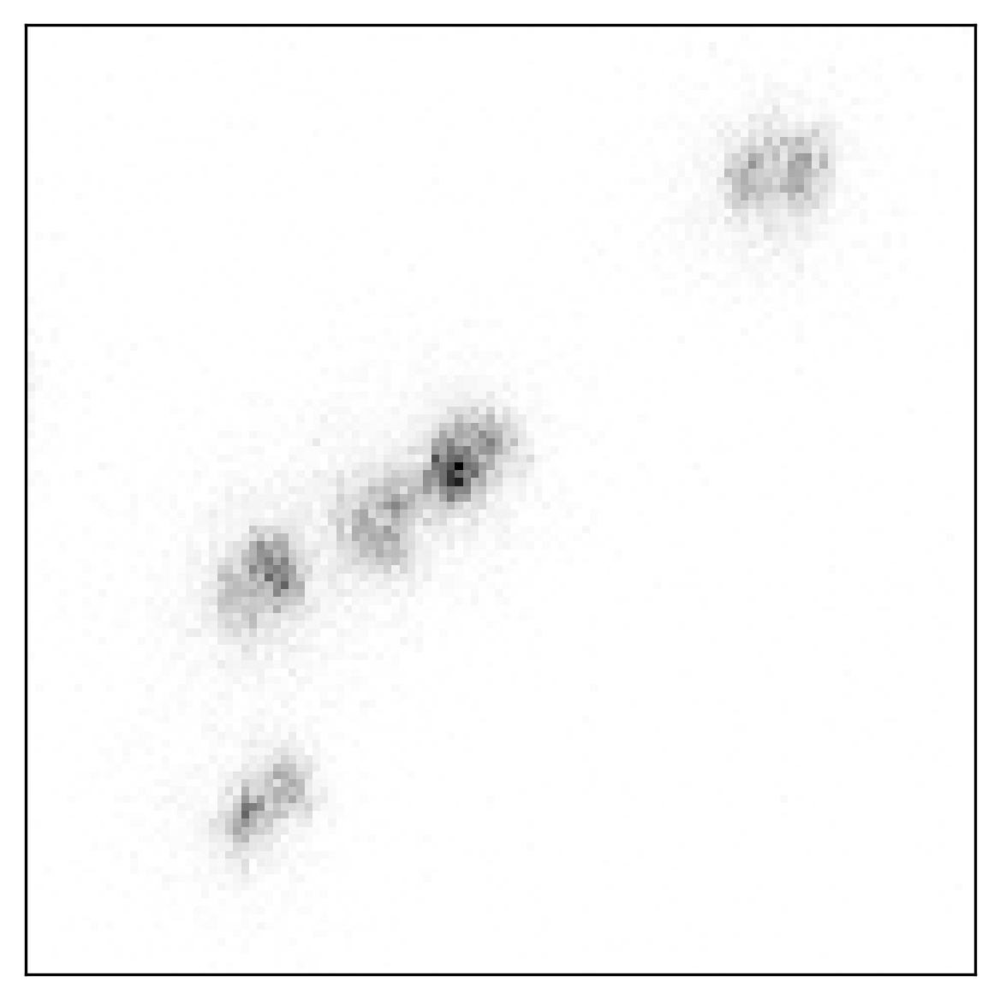
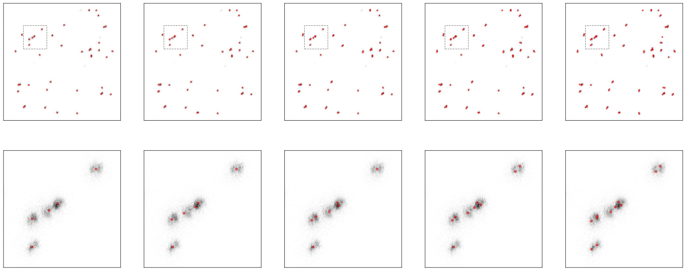
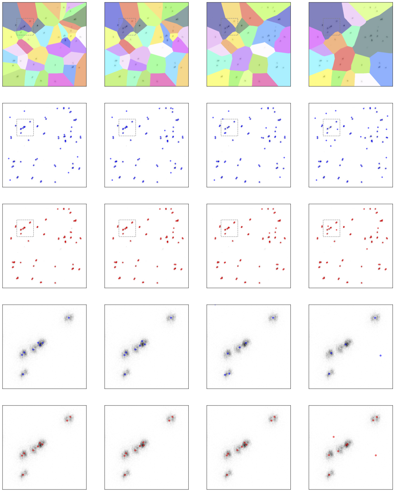
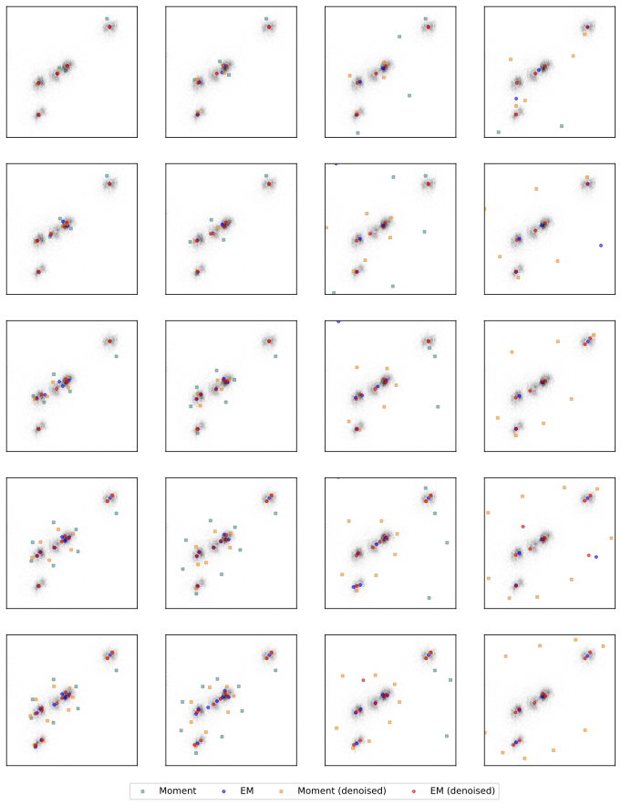

## Here the results are stored

For the corresponding `dataset` a folder is created with the same name. The folder contains the estimations in two ways:

- `estimations_d{delta}.json` aggregated estimations,
- `estimations/estim_{denoised}_d{delta}_n{num_atoms}_sc{scale}_{estimator}.json` explicit locations.

Also the folder contains the `config.json` file used for the estimation and `plot-config.json` file used for plotting the results (only specified parameters are plotted).

```json
{
  "x_lim": [0.17, 0.37],
  "y_lim": [0.61, 0.81],
  "best_delta": 0.025,
  "estimators": ["Moment", "EM (moment)"],
  "deltas": [0.025, 0.05, 0.075, 0.1],
  "num_atoms": [40, 50, 60, 70, 80],
  "split_estim_config": {
    "num_atoms": 70,
    "estimator": "EM (moment)"
  },
  "zoom_estim_config": {
    "num_atoms": [40, 50, 60, 70, 80],
    "estimators": ["Moment", "EM (moment)"]
  }
}
```

`x_lim` and `y_lim` are the limits of the zoom-in region.

<p align="center">
  
   
</p>

`estimators` are the estimators used to estimate the parameters of the normal distribution.

`deltas` used for Voronoi diagrams, the smaller the value, the smaller the cell size.

`num_atoms` is the number of mixture components.

`best_delta` one of `deltas`, which is used to make individual plots for each estimator from `estimators`, with different `num_atoms` (from left to right).

<p align="center">
  
</p>

`split_estim_config` is the configuration used to plot estimations of `estimator` for different `deltas` (from left to right) and fixed `num_atoms`. Red dots are the estimations for denoised data, blue dots are the estimations for the original data.

<p align="center">
  
</p>

`zoom_estim_config` is the configuration used to plot estimations in the zoom-in region for different `deltas` (from left to right), `num_atoms` (from top to bottom) and `estimators`.

<p align="center">
  
</p>
