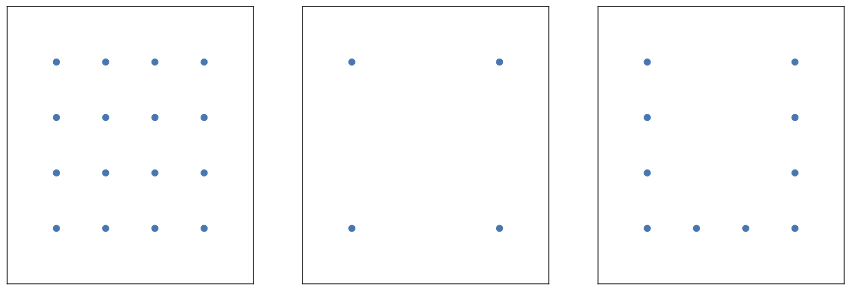

## Here simulation results are stored

To run a simulation, create a folder in the `simulations` directory.
The folder should contain a `config.json` file with the simulation settings.

```json
{
  "num_experiments": 20,
  "n_bins": [10, 20, 40, 80],
  "t_values": {
    "start": 0,
    "stop": 8,
    "num": 39,
    "step": 2
  },
  "scales": [0.01, 0.05, 0.1],
  "atoms_data": [
    {
      "type": "grid",
      "num_points": 4
    },
    {
      "type": "corners",
      "num_points": 2
    },
    {
      "type": "u-shape",
      "num_points": 4
    }
  ]
}
```

`num_experiments` is the number of experiments to run for each setting.

`n_bins` is the number of bins along each dimension.

`t_values` is the illumination times. From $10^{start}$ to $10^{stop}$ with `num` points and `step` step.

`scales` is the scales of the normal distribution (like standard deviation).

`atoms_data` specifies the atoms to use in the simulation. `num_points` is the number of points along each dimension.

<p align='center'> </p>

Each pair `scale` and `n_bins` is considered as a setting. The `setting_id` is the index of the setting, used to run the simulation.
