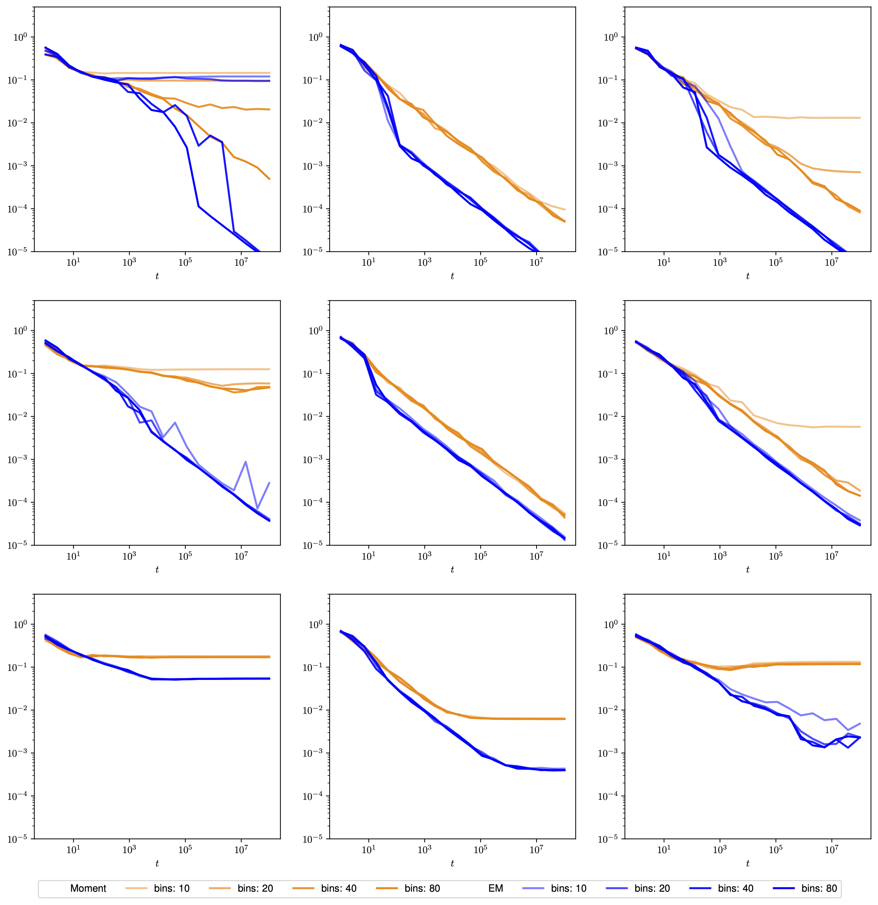
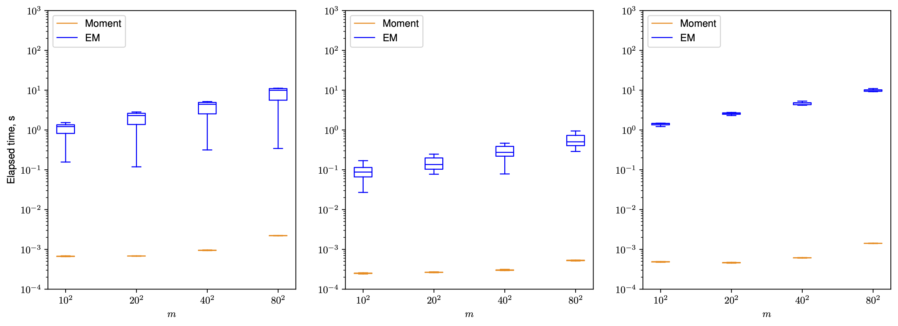

## Configuring simulation settings

1. Create a folder in the `simulations` directory with a desired name (this `simulation_name` is used to identify the simulation).
2. Store the `config.json` file in the folder with the following structure:

```json
{
  "num_experiments": 20,
  "n_bins": [10, 20, 40, 80],
  "t_values": {
    "start": 0,
    "stop": 8,
    "num": 39,
    "step": 2
  },
  "scales": [0.01, 0.05, 0.1],
  "atoms_data": [
    {
      "type": "grid",
      "num_points": 4
    },
    {
      "type": "corners",
      "num_points": 2
    },
    {
      "type": "u-shape",
      "num_points": 4
    }
  ]
}
```

### Parameters

- `num_experiments`: The number of experiments to average the results over.
- `n_bins`: The number of bins along each dimension.
- `t_values`: The illumination times. From $10^{start}$ to $10^{stop}$ with `num` points and `step` step.
- `scales`: The scales of the normal distribution (i.e. standard deviation).
- `atoms_data`: Specifies the atoms arrangements to use in the simulation.
  - `type`: The type of arrangement. Available options are `grid`, `corners`, and `u-shape`.
  - `num_points`: The number of points along each dimension.

<p align='center'> </p>

Each combination of `scale` and `n_bins` constitutes a unique setting. The `setting_id` is the index assigned to each setting, which is used to run the simulation. The `setting_id` is calculated as `setting_id = n_bins_index * len(scales) + scales_index`.

## Results overview

1. The simulation results are stored in the `{simulation_name}/data` folder.
2. The plots are saved in the `{simulation_name}/img` folder.

- `points_arrangement.pdf`: The arrangement of atoms in the simulation (from right to left: `atoms_data.type`).

<p align='center'> </p>

- `error_Moment_EM.pdf`: Average 1-Wasserstein errors along `t_values` over `num_experiments` repetitions for the method of moments estimator (orange) and the EM algorithm (blue) (from right to left: `atoms_data.type`; from top to bottom: `scales`).

<p align='center'> </p>

- `time_complexity.pdf`: Computational runtime for the method of moments estimator and the EM algorithm
  (from right to left: `atoms_data.type`).

<p align='center'> </p>
